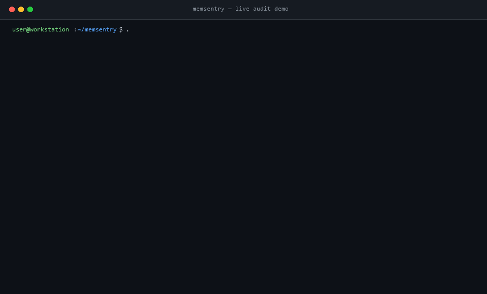
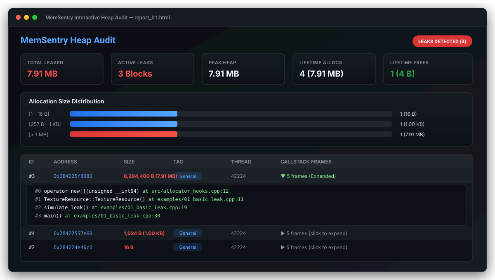

<div align="center">

# MemSentry

**High-Performance C++20 Memory Leak Detector & Heap Profiler**

[](https://github.com/latryee/MemSentry/actions)
[](https://en.cppreference.com/w/cpp/20)
[](https://github.com/latryee/MemSentry)
[](https://github.com/latryee/MemSentry/blob/main/LICENSE)
[](https://github.com/latryee/MemSentry)

<br/>



</div>

---

## Overview

**MemSentry** is a cross-platform memory leak detection and heap profiling engine written in Modern C++ (C++20). Designed for high-throughput systems (game engines, backend services, real-time audio/graphics pipelines), it provides allocation tracking, native callstack symbol resolution, red-zone canary corruption protection, scoped subsystem tagging, snapshot diffing, and multi-format report exports.

---

## Key Features

- **Allocation Interception**: Overloads global C++ `new`/`delete` (including sized deallocations, `nothrow`, and C++17 `std::align_val_t` overloads) with thread-local recursion guards.
- **High-Throughput Sharded Tracker**: 64 cache-line padded hash shards (`alignas(64)`) to minimize lock contention across multi-threaded workloads.
- **Red-Zone Canary Bounds Checking**: Wraps allocated blocks with 64-bit magic signatures (`0xDEADBEEFCAFEBABE` / `0xBAADF00D5EADC0DE`) to catch buffer underruns, overruns, and double-free anomalies.
- **Native Callstack Capture & Demangling**: Resolves source filenames, demangled function symbols, and line numbers using Windows `DbgHelp` and POSIX `backtrace` / `abi::__cxa_demangle`.
- **Heap Snapshot Diffing**: Compare baseline vs post-workload memory snapshots (`compare_snapshots`) to isolate transient allocations from persistent leaks.
- **Subsystem RAII Tagging**: Tag memory by engine subsystem (`MEMSENTRY_SCOPE_TAG("RenderPipeline")`) for granular allocation attribution.
- **Multi-Format Exporters**:
  - ANSI colored terminal audit tables with demangled stack frames.
  - JSON schema exports for CI/CD automated regression testing.
  - Self-contained dark-mode interactive HTML dashboards with size distribution histograms and expandable callstack trees:

<br/>



---

## Performance Benchmarks & Measured Overhead

Measured using the built-in benchmark suite (`tests/benchmark.cpp`) on Windows 11 x64 (Clang 22.1 / LLVM-MinGW UCRT, `-O3` optimization):

### 1. Single-Threaded Allocation Latency (100,000 alloc/free cycles)

| Configuration | Latency per Op | Throughput | Overhead vs Raw `malloc` |
|---|:---:|:---:|:---:|
| **Baseline (Direct `malloc` / `free`)** | **33.4 ns** | **29.9 M ops/s** | 1.00x *(Reference)* |
| **MemSentry (Minimal Tracking)** | **150.8 ns** | **6.63 M ops/s** | 4.51x |
| **MemSentry (+ Red-Zone Canary)** | **156.1 ns** | **6.40 M ops/s** | 4.67x *(+5.3 ns for canary)* |
| **MemSentry (+ Canary & Native Stacktrace)** | **532.9 ns** | **1.88 M ops/s** | 15.95x *(Stack capture cost)* |

> [!NOTE]
> In real-world applications where memory allocation constitutes 2–10% of CPU time, a ~150 ns tracking overhead translates to approximately **1.05x – 1.15x total application runtime**. In allocation-saturated microbenchmarks, the raw allocation overhead is 4.5x without stacktraces and ~16x with full stack unwind capture.

### 2. Multi-Threaded Throughput Scaling (64 Cache-Aligned Shards)

| Thread Count | Total Throughput | Latency per Op |
|:---:|:---:|:---:|
| **1 Thread** | 5.34 M ops/s | 187.1 ns |
| **2 Threads** | 7.34 M ops/s | 136.3 ns |
| **4 Threads** | 8.19 M ops/s | 122.1 ns |
| **8 Threads** | 8.66 M ops/s | 115.5 ns |

---

## Technical Comparison

How **MemSentry** compares against existing industry tooling:

| Feature / Capability | **MemSentry** | **AddressSanitizer (ASan)** | **Valgrind (Memcheck)** | **Heaptrack** | **VS CRT Debug Heap** |
|---|:---:|:---:|:---:|:---:|:---:|
| **Primary Focus** | Leak Tracking & Profiling | Memory Safety & UB | Deep Memory Emulation | Heap Profiling | Debug Allocation Tracking |
| **App Runtime Overhead** | **~1.05x – 1.15x** *(Stacktrace off)* | ~2.0x *(Moderate)* | ~20x – 50x *(Severe)* | ~1.2x *(Low)* | ~2x – 5x *(Moderate)* |
| **Recompile Required** | ❌ **No** *(Link static lib)* | ⚠️ **Yes** (`-fsanitize=address`) | ❌ **No** | ❌ **No** | ⚠️ **Yes** (`_CRTDBG_MAP_ALLOC`) |
| **Cross-Platform** | ✅ **Win / Linux / macOS** | ⚠️ Partial on MSVC | ❌ Linux only | ❌ Linux only | ❌ Windows MSVC only |
| **Concurrency Scaling** | ✅ **64-Shard Concurrent Table** | N/A *(Shadow memory)* | ❌ Serialized emulation | ⚠️ Mutex queue | ❌ Global CRT lock |
| **Interactive HTML Dashboard** | ✅ **Built-in (Zero dependencies)** | ❌ Text log only | ❌ External tool needed | ⚠️ Local Qt GUI only | ❌ Output window only |
| **Live Snapshot Diffing** | ✅ **`compare_snapshots()` API** | ❌ Process exit only | ❌ Manual deltas | ⚠️ Post-mortem only | ⚠️ Primitive checkpoint |
| **Subsystem Tagging** | ✅ **`MEMSENTRY_SCOPE_TAG()`** | ❌ No | ❌ No | ❌ No | ❌ No |
| **Red-Zone Bounds Checking** | ✅ **64-bit Header & Footer** | ✅ Shadow redzones | ✅ Byte-level simulation | ❌ No | ⚠️ Static byte pattern |

---

## Architecture

```
+-------------------------------------------------------------------------+
|                            Application Layer                            |
|             (Raw Allocations, STL Containers, Scoped Tags)              |
+------------------------------------+------------------------------------+
                                     |
                                     v
+-------------------------------------------------------------------------+
|                       MemSentry Interception Engine                     |
|           - Global new / delete / new[] / delete[] Hooks                |
|           - Thread-Local Recursion Guard                                |
+------------------+----------------------------------+-------------------+
                   |                                  |
                   v                                  v
+------------------------------------+  +---------------------------------+
|        Red-Zone Canary Guard       |  |     Stack Backtrace Engine      |
|  (Buffer Overrun / Underrun Check) |  |  (CaptureStackBackTrace/Syms)   |
+------------------+-----------------+  +-----------------+---------------+
                   |                                      |
                   +------------------+-------------------+
                                      |
                                      v
+-------------------------------------------------------------------------+
|                       Sharded Concurrent Tracker                        |
|             - 64 Cache-Aligned Shards with Fine-Grained Locks           |
|             - Lock-Free Atomic Heap Statistics & Watermarks             |
+------------------+------------------+------------------+----------------+
                   |                  |                  |
                   v                  v                  v
+---------------------+    +--------------------+    +--------------------+
|  Terminal Reporter  |    |   Snapshot Engine  |    |   HTML Dashboard   |
|   (ANSI Tabular)    |    |  (Differential UI) |    | (Dark-Mode UI/JS)  |
+---------------------+    +--------------------+    +--------------------+
```

---

## Quick Start

### 1. Basic Leak Detection

Include the header and initialize the runtime:

```cpp
#include "memsentry/memsentry.hpp"

int main() {
    memsentry::init();

    // Intentional leak
    int* leaked_data = new int[128];
    (void)leaked_data;

    // Exports standalone HTML visualizer & JSON report
    memsentry::export_html("memory_report.html");
    return 0;
}
```

### 2. Scoped Subsystem Tagging

Track memory consumption by engine module:

```cpp
#include "memsentry/memsentry.hpp"

void load_textures() {
    MEMSENTRY_SCOPE_TAG("AssetManager");
    char* texture_cache = new char[1024 * 1024];
    (void)texture_cache;
}

void update_physics() {
    MEMSENTRY_SCOPE_TAG("PhysicsEngine");
    float* rigid_bodies = new float[512];
    (void)rigid_bodies;
}
```

### 3. Differential Snapshot Analysis

Isolate leaks occurring within a specific operation or request:

```cpp
#include "memsentry/memsentry.hpp"

void handle_request() {
    auto baseline = memsentry::take_snapshot("Baseline");

    process_transaction();

    auto post_workload = memsentry::take_snapshot("PostWorkload");

    auto diff = memsentry::profiler::compare_snapshots(baseline, post_workload);
    memsentry::reporter::ConsoleReporter::print_diff(std::cout, diff);
}
```

---

## Building & Integration

### CMake Integration

```cmake
add_subdirectory(memsentry)
target_link_libraries(your_project PRIVATE memsentry::memsentry)
```

### Command-Line Build

#### Windows
```cmd
build.bat
```

#### Linux / macOS
```bash
make
```

Binaries will be placed in the `bin/` directory.

---

## Configuration

Options are configured via `memsentry::Config`:

```cpp
memsentry::Config config;
config.enable_canary = true;           // Enable red-zone bounds checking
config.enable_stacktrace = true;       // Enable native stack backtraces
config.max_stack_depth = 32;           // Max stack frames captured
config.stack_skip_frames = 2;          // Skip internal profiler frames
config.auto_report_on_exit = true;     // Dump leak summary on std::atexit
config.exit_with_code_on_leak = false; // Exit with error code on leak (CI)
config.default_tag = "General";        // Default allocation tag

memsentry::init(config);
```

---

## Repository Layout

```
.
├── .github/
│   └── workflows/
│       └── ci.yml                     # Multi-OS CI Matrix (Windows, Linux, macOS)
├── assets/
│   ├── demo.gif                       # Terminal demo animated recording
│   ├── demo.tape                      # VHS recording configuration script
│   ├── dashboard_preview.svg          # HTML dashboard vector render
│   ├── terminal_demo.svg              # ANSI terminal demo vector render
│   └── social_preview.png             # OpenGraph social preview image
├── scripts/
│   └── generate_demo_gif.py           # Real-output terminal GIF generator
├── CMakeLists.txt                     # Modern CMake 3.16+ build configuration
├── Makefile                           # Linux/macOS build script
├── build.bat                          # Windows one-click build script
├── README.md                          # Project documentation
├── LICENSE                            # MIT License
├── include/
│   └── memsentry/
│       ├── memsentry.hpp              # Public unified header
│       ├── config.hpp                 # Configuration options
│       ├── types.hpp                  # Data structures and atomic stats
│       ├── core/
│       │   ├── recursion_guard.hpp    # Thread-local recursion blocker
│       │   ├── header.hpp             # Header layout and canary validation
│       │   ├── sharded_tracker.hpp    # 64-shard concurrent tracking table
│       │   └── allocator_hooks.hpp    # Global allocator overloads
│       ├── stacktrace/
│       │   └── stacktrace.hpp         # Cross-platform stack resolution
│       ├── profiler/
│       │   ├── scope_tag.hpp          # RAII allocation tagging
│       │   ├── snapshot.hpp           # Differential snapshot engine
│       │   └── histogram.hpp          # Size-class distribution metrics
│       └── reporter/
│           ├── console_reporter.hpp   # ANSI terminal formatting
│           ├── json_reporter.hpp      # JSON serialization
│           └── html_reporter.hpp      # Single-file HTML visualizer
├── src/
│   ├── memsentry.cpp                  # Manager singleton & runtime hooks
│   ├── allocator_hooks.cpp            # Global new/delete definitions
│   ├── stacktrace.cpp                 # DbgHelp / libunwind implementation
│   ├── snapshot.cpp                   # Differential analysis algorithms
│   └── reporter.cpp                   # Exporter implementations
├── examples/
│   ├── demo.cpp                       # Comprehensive live runtime audit demo
│   ├── 01_basic_leak.cpp              # Exit reporting and leak diagnosis
│   ├── 02_scoped_profiling.cpp        # Multi-threaded subsystem profiling
│   ├── 03_snapshot_diffing.cpp        # Delta comparison across operations
│   └── 04_buffer_overflow.cpp         # Red-zone canary violation detection
└── tests/
    ├── test_tracker.cpp               # Multi-threaded concurrency stress test
    ├── test_canary.cpp                # Bounds corruption unit tests
    ├── test_suite.cpp                 # Comprehensive unit test suite
    └── benchmark.cpp                  # Reproducible performance benchmark
```

---

## License

This project is licensed under the [MIT License](LICENSE).
